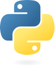

# Python Component for Diploi

[](https://diploi.com/component/python)
[](https://diploi.com/component/python)
[](https://diploi.com/component/python)

## Operation

### Getting started

1. In the Dashboard, click **Create Project +**
2. Under **Pick Components**, choose **Python**. Here you can also add a frontend framework to create a monorepo app, eg, Python for backend and React+Vite for frontend
3. In **Pick Add-ons**, you can add one or multiple databases to your app
4. Choose **Create Repository** to generate a new GitHub repo
5. Finally, click **Launch Stack**

### Development

During development, the container installs `watchfiles` to enable automatic reloads when files change. The development server is started with:

```sh
uv run watchfiles "python src/main.py"
```

This will:
- Use `watchfiles` to watch for file changes and restart the server automatically.
- Run `src/main.py` in an isolated Python environment managed by `uv`.
- Automatically detect whether to use `pyproject.toml` or `requirements.txt` for dependency resolution.

### Production

Builds a production-ready image. During the build, dependencies are installed with `uv sync` or `uv pip install`. When the container starts, it runs:

```sh
uv run --frozen src/main.py
```

This starts your Python application using the exact dependency versions locked in the project.

## Links

- [Python documentation](https://docs.python.org/)
- [uv documentation](https://docs.astral.sh/uv/)
